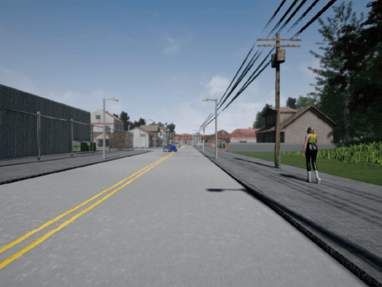
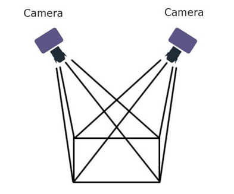
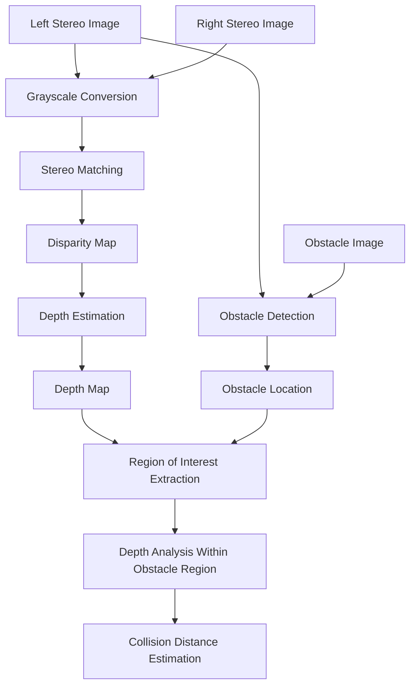
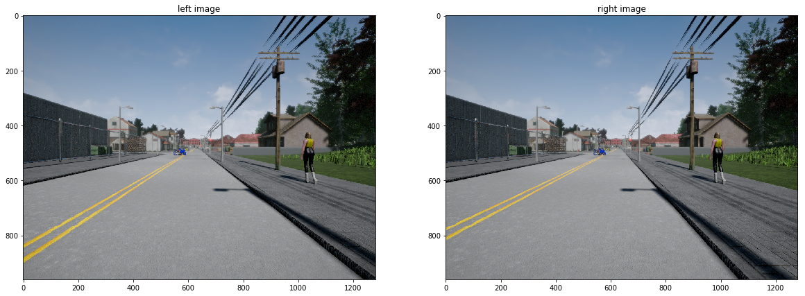
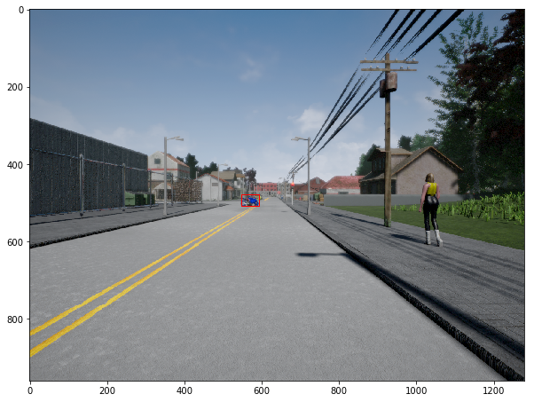

# Stereo-Vision-Depth-Map

⭐ **1. Introduction**

This project implements a stereo vision pipeline for obstacle detection and distance estimation using OpenCV. It generates disparity and depth maps from stereo image pairs to recover scene geometry.

Object localization is then used to identify obstacles, and depth information is applied to estimate their distance for basic collision awareness.

<table>
  <tr>
    <td align="center">
      <b></b> 
      
    </td>
  </tr>
</table>

---

🧩 **2. Challenge**

Key challenges addressed in this project include: 

- Estimating depth information from a pair of stereo images using visual cues alone.
- Identifying the position of a specific obstacle within a full driving scene.
- Extracting a reliable distance measurement for the obstacle from a noisy depth map.

---

🎯 **3. Objectives**

- Estimate depth information from stereo image pairs using OpenCV-based disparity computation.
- Identify and locate obstacles within a driving scene using image matching techniques.
- Compute the nearest distance to an obstacle using depth information for collision awareness.

---

🛠 **4. Tech Stack**

This project uses classical computer vision techniques for stereo-based depth and obstacle perception:

- **Python** – core implementation of the stereo vision pipeline  
- **NumPy** – numerical operations for image processing and depth calculations  
- **OpenCV** – stereo matching (StereoSGBM), image processing, and camera geometry utilities including:
  - `StereoSGBM` for disparity estimation  
  - `cvtColor` for grayscale conversion  
  - `matchTemplate` for obstacle localization  
  - `minMaxLoc` for extracting best match positions  
  - `decomposeProjectionMatrix` for camera calibration decomposition  
- **Matplotlib** – visualization of stereo images, disparity maps, and depth maps  
- **Camera Geometry** – projection matrices and stereo calibration for depth estimation  
- **Stereo Vision** – disparity-based depth reconstruction from stereo image pairs  
- **Cross-Correlation (Template Matching)** – locating obstacles within the scene

---

🧩 **5. Basics**

*(A) Stereo Cameras*  

Stereo cameras capture the same scene from two slightly different viewpoints, similar to human binocular vision. The difference between the two images is used to estimate depth information.

In this project, stereo image pairs are used to compute a **disparity map**, which forms the basis for depth estimation.

<table>
  <tr>
    <td align="center">
      <b>Typical Stereo Setup</b> 
      
    </td>
  </tr>
</table>

*(B) Disparity Maps*  

A disparity map represents the pixel-wise shift between corresponding points in the left and right stereo images. Larger shifts indicate closer objects, while smaller shifts indicate distant regions.

In this project, disparity is computed using OpenCV’s StereoSGBM algorithm and serves as the intermediate representation for depth estimation.

*(C) Depth Maps*  

A depth map converts disparity values into real-world distance estimates using camera calibration parameters such as focal length and baseline.

In this project, the depth map provides per-pixel distance information, which is later used to estimate the distance to detected obstacles.

*(D) Obstacle Localization (Template Matching)*  

Obstacle localization is performed by finding where a known object appears within the full scene image. This is done using template matching, which compares a cropped obstacle image against different regions of the scene to find the best visual match.

In this project, OpenCV’s `matchTemplate` function is used to compute a similarity map between the obstacle image and the scene. The location with the highest similarity score is selected as the position of the obstacle. This provides a simple way to identify the region of interest for further depth-based distance estimation.

---

🧠 **6. Simplified Pipeline Setup**

- **Stereo/ Obstacle Images**: Stereo images consist of two views of the same scene captured from slightly different positions, while the obstacle image represents a cropped region of the object to be detected within the scene.
- **Grayscale Conversion**: Reduces a color image to a single intensity channel, simplifying the data for more efficient and reliable stereo matching.
- **Stereo Matching**: Process of finding corresponding points between left and right images of the same scene to estimate pixel-wise depth differences.
- **Depth Estimation**: Converts disparity information from stereo images into real-world distance values using camera geometry and calibration parameters.
- **Object Detection and Location**: Identifies a target object in the scene and determines its position within the image for further analysis.
- **Depth Analysis Within Obstacle Region**: Extracts depth values from the area of the detected object to estimate how far different parts of the obstacle are from the camera.
- **Collision Distance Estimation**: Determine the minimum distance to an obstacle by selecting the closest depth value within the detected object region.

---

📈 **7. Results**

The image below shows the stereo image pair (left and right views) used as input for depth estimation.

<table>
  <tr>
    <td align="center">
      
      
<b>Stereo Image Pair (Left and Right Views)</b>

    </td>
  </tr>
</table>

The visualizations below shows the disparity map, depth map, obstacle localization heatmap, and the final estimated distance to the obstacle.

<table>
  <tr>
    <td align="center">
      
      
<b>Disparity Map</b>

    </td>
    <td align="center">
      
      
<b>Depth Map</b>

    </td>
  </tr>

  <tr>
    <td align="center">
      
      
<b>Cross Corelation Heatmap</b>

    </td>
    <td align="center">
      
      
<b>Distance to Obstacle (29.091 m) </b>

    </td>
  </tr>
</table>

---

